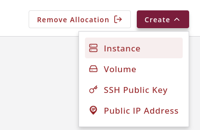
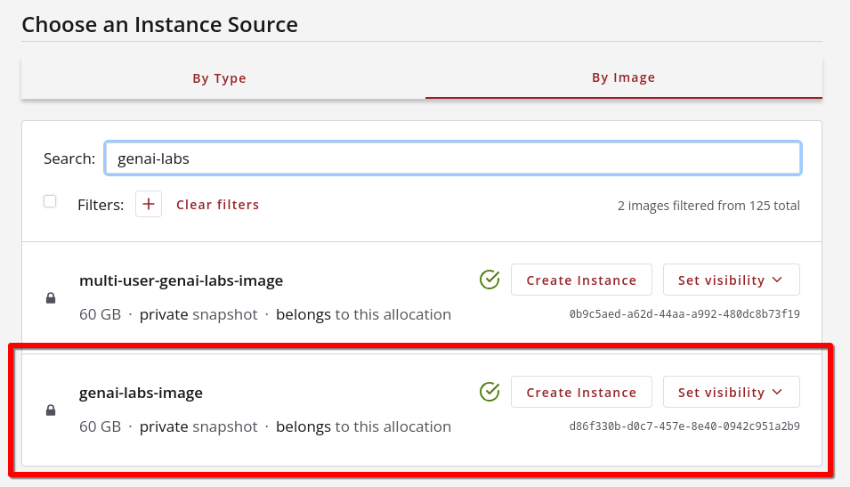
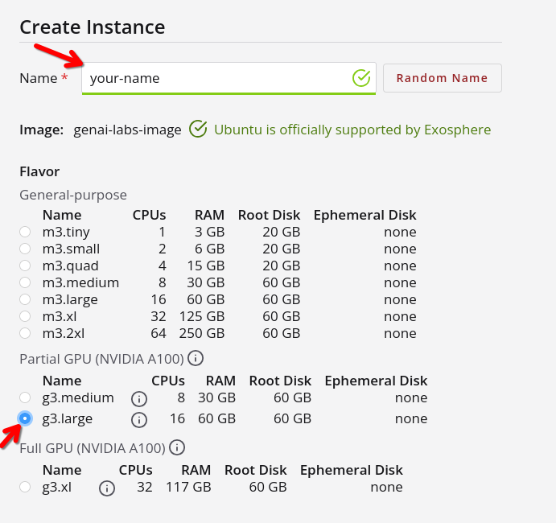
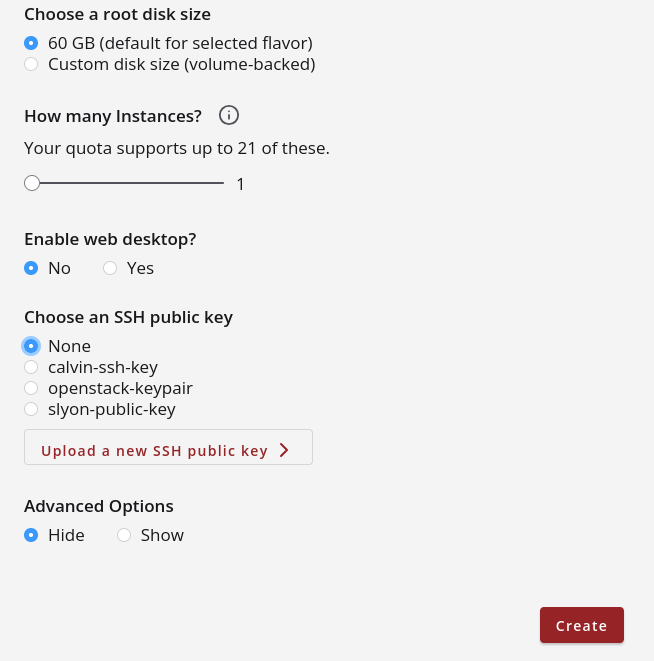
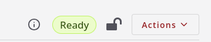
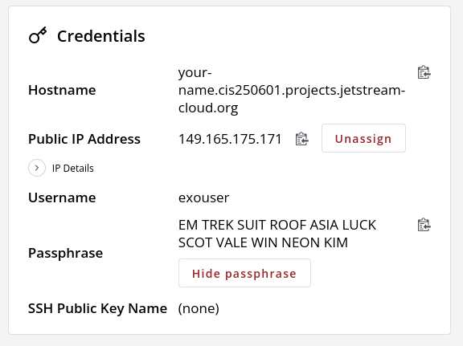
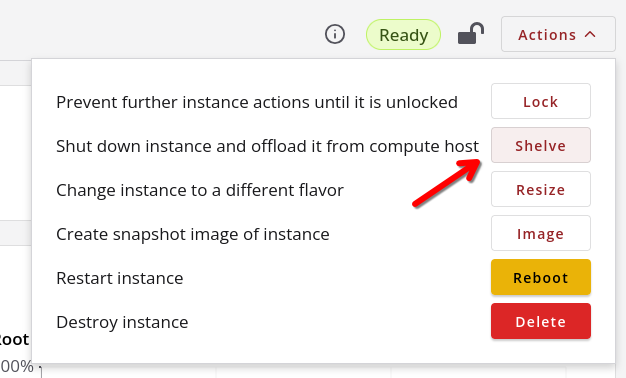
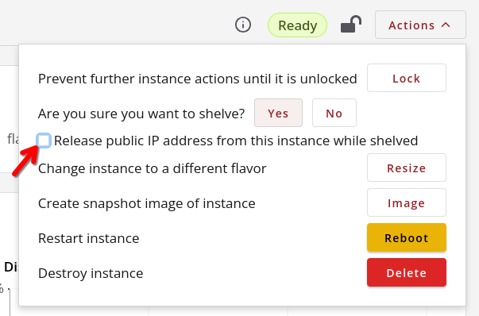
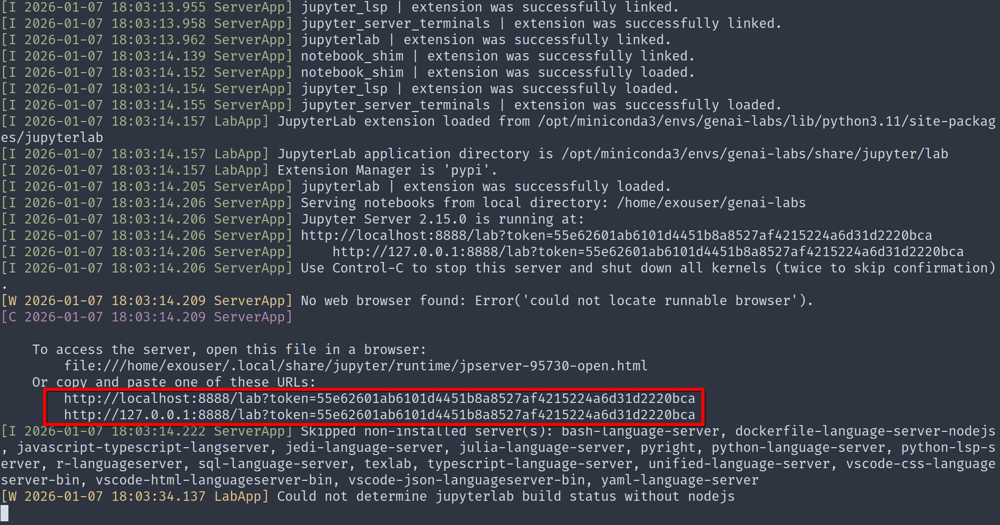

# GenAI Lab Setup Guide for Jetstream2

## Registering Account

To be added to a Jetstream2 allocation, you must have an NSF ACCESS CI account.
You can register for an account by following this [guide](access-ci-account-instructions.md). Once you have registered for an
account, please provide your ACCESS Username to Prof. Luo so that he can add you
to the allocation.

## Managing Instances

### Creating Your Instance

After you are added to the allocation, you can access it by visiting Jetstream2's [Exosphere tool](https://jetstream2.exosphere.app), logging in with your ACCESS CI credentials. After you navigate to the allocation, you can create your instance by clicking the 'Create' menu in the top-right corner and selecting 'Instance', as shown in the image below.



You will be brought to the "Choose an Instance Source" where you can select the image for your instance. We have created a custom image for this course, which is named 'genai-labs-image'. This image can be found by selecting "By Image" and searching for the image name, shown in the red box in the image below.



After selecting the image, you will be brought to a page to further customize your instance, shown in the images below. Please use your own name for the instance name to make it easier to keep track of who owns which instance. For instance, flavor select 'g3.large'.  <em>Optionally</em>, you can upload your SSH public key to make logging into the instance easier.




Once you have finished customizing the instance, click the 'Create' button in the lower left. The instance will take some time (around 3-4 minutes) to build. When it is finished building its status will change to 'Ready', which is shown in the image below.



### Accessing Your Instances

Now that you have a running instance, you should be able to log in. The IP address, username, and password are displayed in the 'Credentials' section on the instance's page, as shown in the image below.



You can use the SSH command-line tool to remotely log in to your server using the command below. If you are on Windows, you can use PowerShell. If you are on Mac/Linux, you can use your default terminal application.

```bash
ssh -L 8888:127.0.0.1:8888 exouser@<Public IP Address of Your Instance>
```

The argument `-L 8888:127.0.0.1:8888` is important as it enables forwarding of port 8888 between your local machine and your remote instance. Port 8888 is the default port used when running a Jupyter server, which is the tool you will use to run the examples and labs in the class.

After you log into the server, make sure you change your password. This can be done by running the `passwd` command in your shell.

### Shelving Your Instances

**!!!!!! IMPORTANT  !!!!!!**

Our allocation has a fixed number of usage credits, and each instance consumes credits while active. It is very important to shelve your instance when you are not actively using it. Shelving an instance saves its current state before shutting it down and freeing its resources. When you unshelve your instances, all of your files should still be there; however, you should always back up to GitHub just in case.

To shelve your instance, click the 'Actions' menu in the top-left corner, then click 'Shelve'.



It will then ask you whether you would like to release the public IP address. If you deselect this option, the same IP address will be assigned to your instance when you start it again. You can then confirm that you would like to shelve the instance by pressing 'Yes'.



## Using Git and GitHub

Run the following commands to change into your home directory and clone the GenAI course's GitHub repository:

```
cd ~
git clone https://github.com/ACANETS/genai-labs.git
```

Here are some basic git commands to help you get started (for a more comprehensive tutorial, please see the [W3 Schools Git Tutorial](https://www.w3schools.com/git/default.asp)):

* `git status` will display the current state of the working directory (which files have been staged for the next commit, which files have been modified since the last commit.
* `git add <file or directory>` will stage a new or modified file/directory for commit.
* `git commit -m "Write a message describing changes here"` will commit any changes that have been staged into the repository's history along with a message on what changes have been made.
* `git log` displays a commit history of the repository, showing the commit hash, author, date, and commit message.
* `git checkout <commit hash>` will revert the state of the repository to a previous commit.

**Creating/Managing GitHub Repository and Downloading Files for Class Assignments:**

1. If not already done, install and configure git on your local machine (see [this guide](https://docs.github.com/en/get-started/getting-started-with-git/set-up-git#setting-up-git)).
2. Create a private GitHub repository (see [this guide on creating a repository](https://docs.github.com/en/repositories/creating-and-managing-repositories/creating-a-new-repository) and [this guide on changing the repository's visibility](https://docs.github.com/en/repositories/managing-your-repositorys-settings-and-features/managing-repository-settings/setting-repository-visibility#changing-a-repositorys-visibility)).
3. Generate an SSH keypair for authentication (see [this guide](https://docs.github.com/en/authentication/connecting-to-github-with-ssh/generating-a-new-ssh-key-and-adding-it-to-the-ssh-agent)).
4. Add your public key to your GitHub account (see [this guide](https://docs.github.com/en/authentication/connecting-to-github-with-ssh/adding-a-new-ssh-key-to-your-github-account)).
5. Clone your private repository to your local machine using SSH (see [this guide](https://docs.github.com/en/repositories/creating-and-managing-repositories/cloning-a-repository#cloning-a-repository)).
6. In the JupyterLab File Browser, right-click on the file you would like to download.
7. You will see a pop-up menu; select the "Download" option in this menu.
8. You can then move the file you downloaded to your cloned git repository.
9. After you have moved all of your project files, you can add the files (`git add <file or directory>`) and commit your changes (`git commit -m "Message describing changes"`).
10. You can then push your changes to GitHub by running `git push` inside of your git repository.

## Launching JupyterLab

We will be using Jupyter to run exercises and labs in this course. To run a JupyterLab server, you can run the command `jupyter lab`. The root directory of the web interface will be whichever directory you are in when running the command, so make sure that your current directory is 'genai-labs', which you cloned from GitHub. The output should look similar to the image below, where it provides URLs for the Jupyter web interface (shown in the red box). If you are unable to access the web interface, make sure that you added the `-L 8888:127.0.0.1:8888` flag to your SSH command.



You can learn about JupyterLab from the [Project Jupyter Documentation](https://docs.jupyter.org/en/latest/) or by trying out the [Try Jupyter tutorial](https://docs.jupyter.org/en/latest/start/index.html).

## Frequently Asked Questions and Issues

If you are having issues with any labs or homework assignments, please take a look at [this document](faq.md), which contains a list of FAQs and common issues and their solutions. Feel free to reach out to the instructor/TA if you are still unable to resolve an issue.
