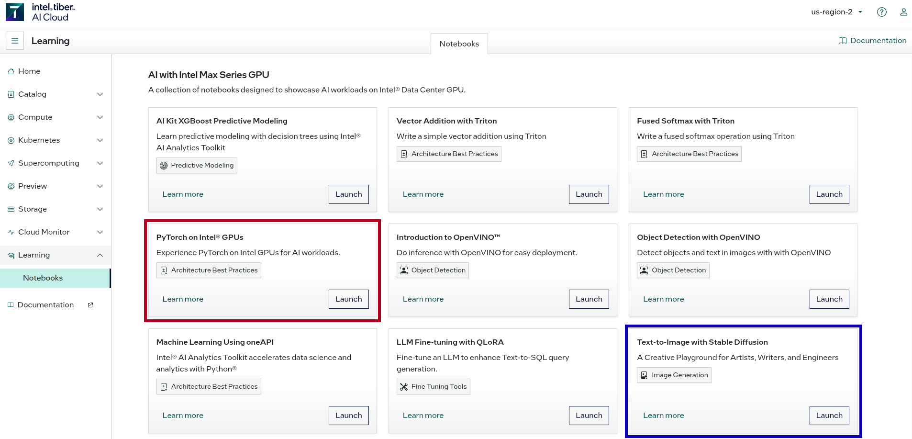

# GenAI Lab Setup Guide

This notebook is the one-stop shop for students to get started on the labs.

## Introduction to Intel Tiber Cloud

Intel® Tiber™ AI Cloud offers a cloud compute platform where you develop solutions on the latest Intel® hardware, AI accelerators, and optimized software stacks. The platform helps you:

* Implement AI deployments, developer ecosystems, and benchmark testing
* Scale AI deployments from virtual machines, single nodes, to super-computing clusters.
* Leverage integration of open source models, accelerator software, and frameworks

### Systems

The AI industry insists workload processing meets rapidly evolving demands for increased performance and scalability. Intel® Tiber™ AI Cloud enables you to deploy AI workloads, and manage containerized workflows, virtual machines, and dedicated systems at a competitive price-performance.

### Software

Intel supports the growing open software ecosystem for AI and actively contributes to open source projects such as PyTorch and UXL Foundation. Dedicated Intel cloud computing is allocated to support open source projects, enabling you to access the latest AI frameworks and models.

### Services

As an enterprise user or developer, you may consume computing AI services differently, depending on technical expertise, implementation requirements, or the use case. Our list of services is constantly evolving. Visit our Services.

## Sign up free account

You can sign up for a free account by following [this guide](https://console.cloud.intel.com/docs/guides/get_started.html).

Once your account registration has been approved, you will be able to access the learning exercises [here](https://console.cloud.intel.com/learning/notebooks).

**Note** : we do not use instances. Instead we use Jupyter Notebooks for the exercises and labs.

## Get Started with JupyterLab

You can learn about JupyterLab through this [tutorial](https://console.cloud.intel.com/docs/tutorials/jupyter_learning.html).

Some lab assignments and excerises have been validated to work with specific kernels (mostly the "PyTorch GPU" and "PyTorch 2.7" kernels) provided by Intel Tiber Cloud. They Jupyter environment loads only one kernel at a time, based on the specific example notebook that you launch. If you want to use another kernel, you will need to log out of that Jupyter session and launch another example notebook. This means that you must launch an example notebook that uses the "PyTorch GPU" or "PyTorch 2.7" kernel before working on any lab assignments or execerises that require that specific kernel.

One of the example notebooks that uses the "PyTorch GPU" kernel is "Simple LLM Inference: Playing with Language Models", and on example notebook that uses the "PyTorch 2.7" kernel is "PyTorch on Intel® GPUs". Once you navigate to the [notebook dashboard](https://console.cloud.intel.com/learning/notebooks) you will find these notebooks under the "AI with Intel Max Series GPU" section (highligted in the image below).



**Note**: any changes that you make to the notebooks will be persistant accross sessions, so it is suggested that you use a version control software (git) to keep track of changes.

## Using Git and Github

Once you have a intance running JupyterLab, you can access a terminal by clicking File > New > Terminal on the top left of the toolbar.

Run the following commands to change into your home directory and clone the GenAI course's github repository:
```
cd ~
git clone https://github.com/ACANETS/genai-labs.git
```

Here are some basic git commands to help you get started (for a more comprehensive tutorial please see the [W3 Schools Git Tutorial](https://www.w3schools.com/git/default.asp)):
  * `git status` will display the current state of the working directory (which files have been staged for the next commit, which files have been modified since the last commit.
  * `git add <file or directory>` will stage a new or modified file/directory for commit.
  * `git commit -m "Write a message describing changes here"` will commit any changes that have been staged into the repositories history along with a message on what changes have been made.
  * `git log` displays a commit history of the repository, showing the commit hash, author, date, and commit message.
  * `git checkout <commit hash>` this command will revert the state of the repository to a previous commit.

**Creating/Managing GitHub Repository and Downloading Files for Class Assignments:**
  1. If not already done, install and configure git on your local machine (see [this guide](https://docs.github.com/en/get-started/getting-started-with-git/set-up-git#setting-up-git)).
  2. Create private GitHub repository (see [this guide on creating a repository](https://docs.github.com/en/repositories/creating-and-managing-repositories/creating-a-new-repository) and [this guide on changing the repository's visability](https://docs.github.com/en/repositories/managing-your-repositorys-settings-and-features/managing-repository-settings/setting-repository-visibility#changing-a-repositorys-visibility)).
  3. Generate an SSH keypair for authentication (see [this guide](https://docs.github.com/en/authentication/connecting-to-github-with-ssh/generating-a-new-ssh-key-and-adding-it-to-the-ssh-agent)).
  4. Add your public key to your GitHub account (see [this guide](https://docs.github.com/en/authentication/connecting-to-github-with-ssh/adding-a-new-ssh-key-to-your-github-account)).
  5. Clone your private repository to your local machine using SSH (see [this guide](https://docs.github.com/en/repositories/creating-and-managing-repositories/cloning-a-repository#cloning-a-repository)).
  6. In the JupyterLab File Browser, right-click on the file you would like to download.
  7. You will see a popup menu, select the "Download" option in this menu.
  8. You can then move the file you downloaded to your cloned git repository.
  9. After you have moved all of your project files, you can add the files (`git add <file or directory>`) commit your changes (`git commit -m "Message describing changes"`).
  10. You can then push you changes to GitHub by running `git push` inside of your git repository.

## Frequently Asked Questions and Issues

If you are having issues with any of the labs/homework assignments, please take a look at [this document](faq.md), which contains a list of FAQ/common issues and their solutions. Feel free to reach out to the instructor/TA if you are still unable to resolve an issue.
