# Account Registration Guide for Access CI

1. Go to https://identity.access-ci.org/new-user-federated to start account
   registration. Select University of Massachusetts Lowell as the Identity
   Provider and press the LOG ON button. This should automatically sign you in
   or bring you to the SSO page for UMass Lowell.
   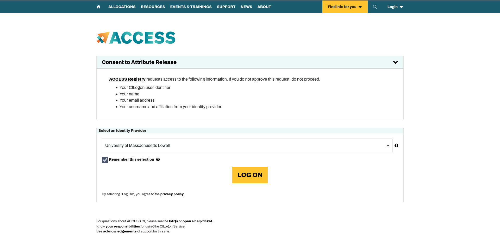

2. You will then be redirected to the Registration Page where you must press the
   Begin button.
   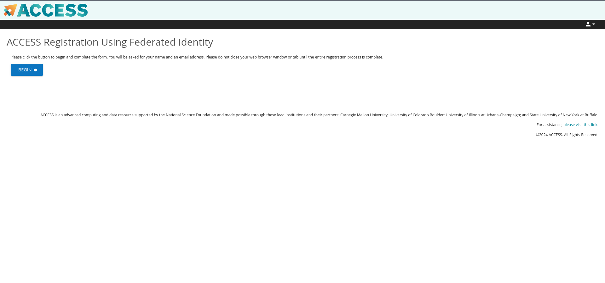
3. Enter your frist/last name and email and then submit.
   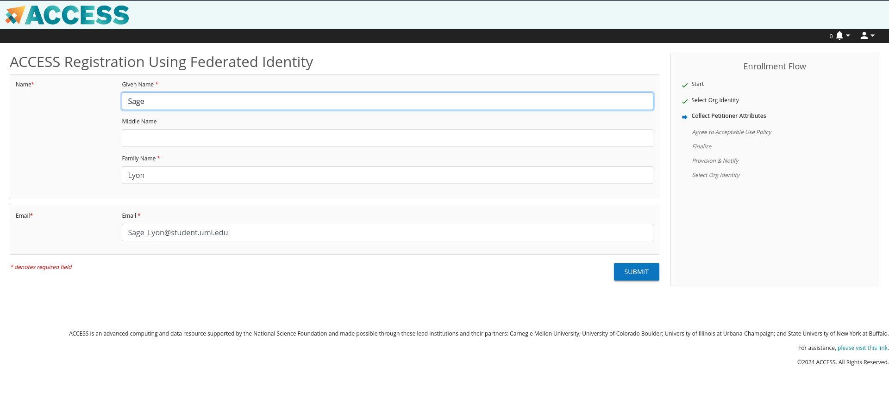
4. ACCESS will send a verfication code to your email. Enter the code and press
   submit.
   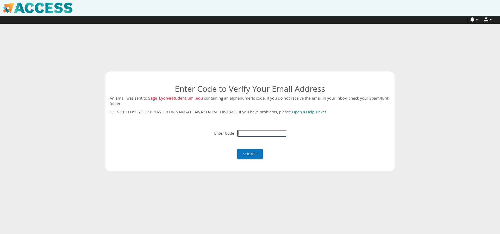
5. Select University of Massachusetts, Lowell as your Home Organization and
   then press select.
   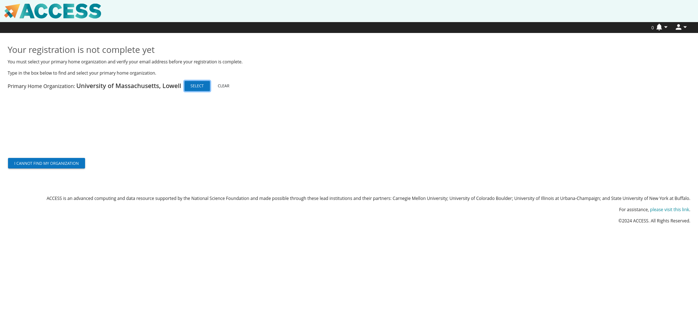
6. Review and agree to the ACCESS Acceptable Use Policy. Then press submit.
   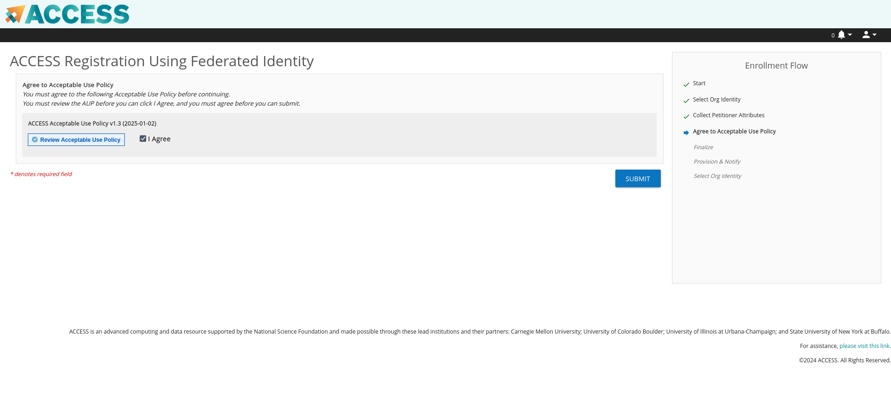
7. ACCESS will then create a new ACCESS ID for you. Set your password after
   pressing the "YES" button and then press submit.
   
8. Your ACCESS account has now been set up. To finish activating the account
   press the ACCESS User Profile link.
   
9. After clicking the link, you will be prompted to log in to ACCESS. Click the
   AUTHENTICATE WITH CILOGIN button.
   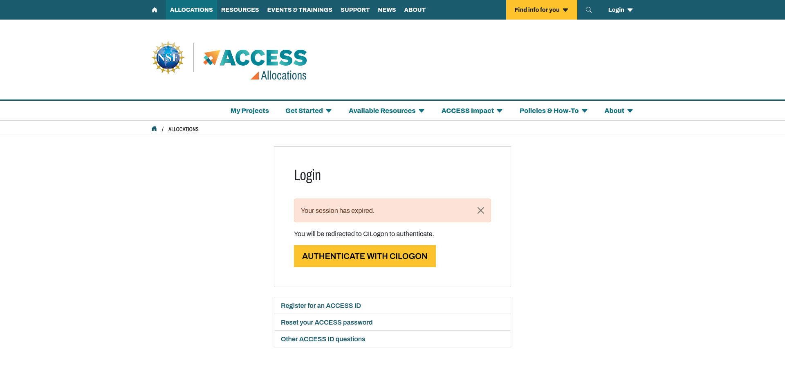
10. CILOGIN will prompt you for your identity provider. Select University of
    Massachusetts Lowell and press the LOG ON button.
   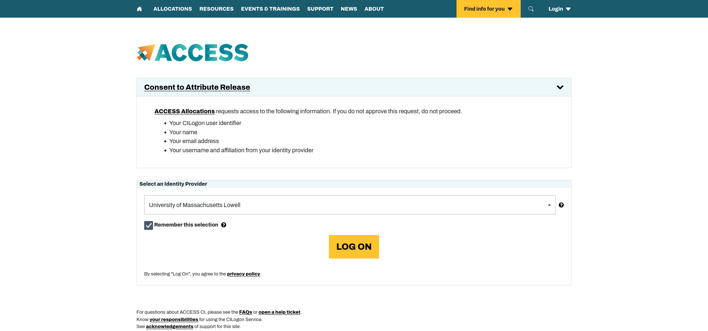
11. Fill in all required fields in the Additional Information section
    (Insitution or organization, Academic status, Current country of residence,
    and Citizenship)
   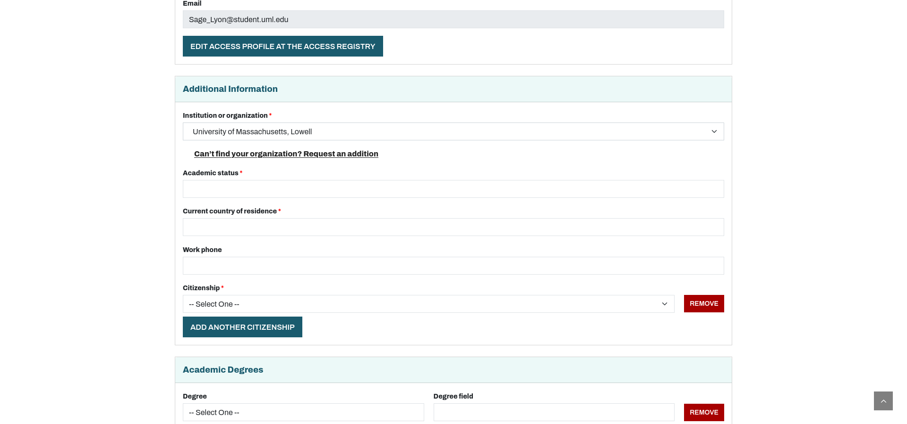
12. Scroll to the bottom of the page and press the SAVE PROFILE button.
   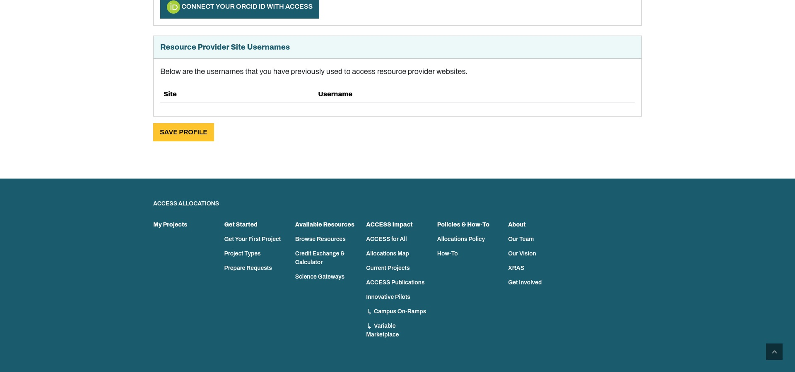
13. At the top of the page you should see a green indicator that your profile
    has been saved. You are now done setting up your ACCESS CI account.
   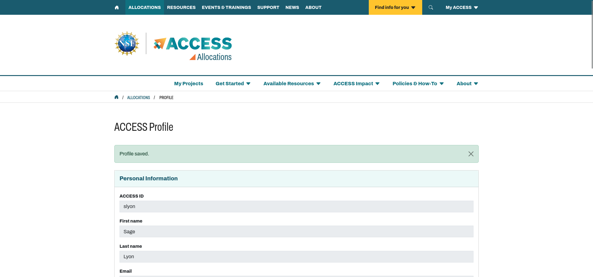

